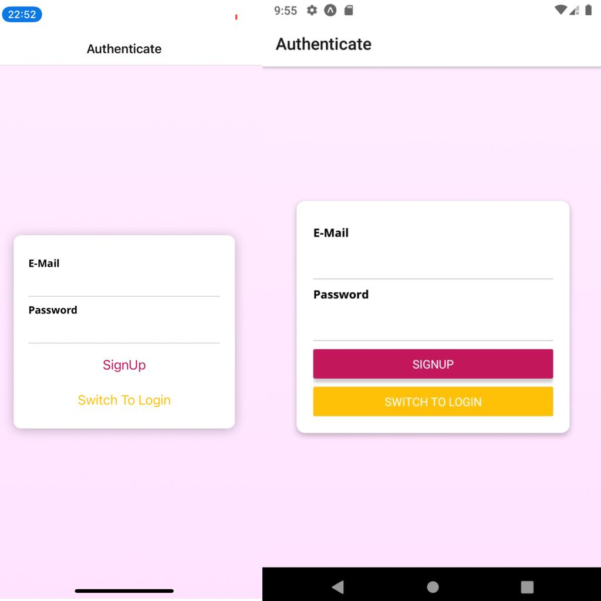
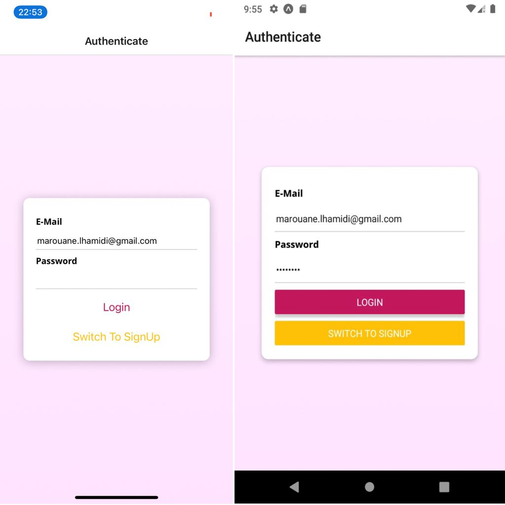
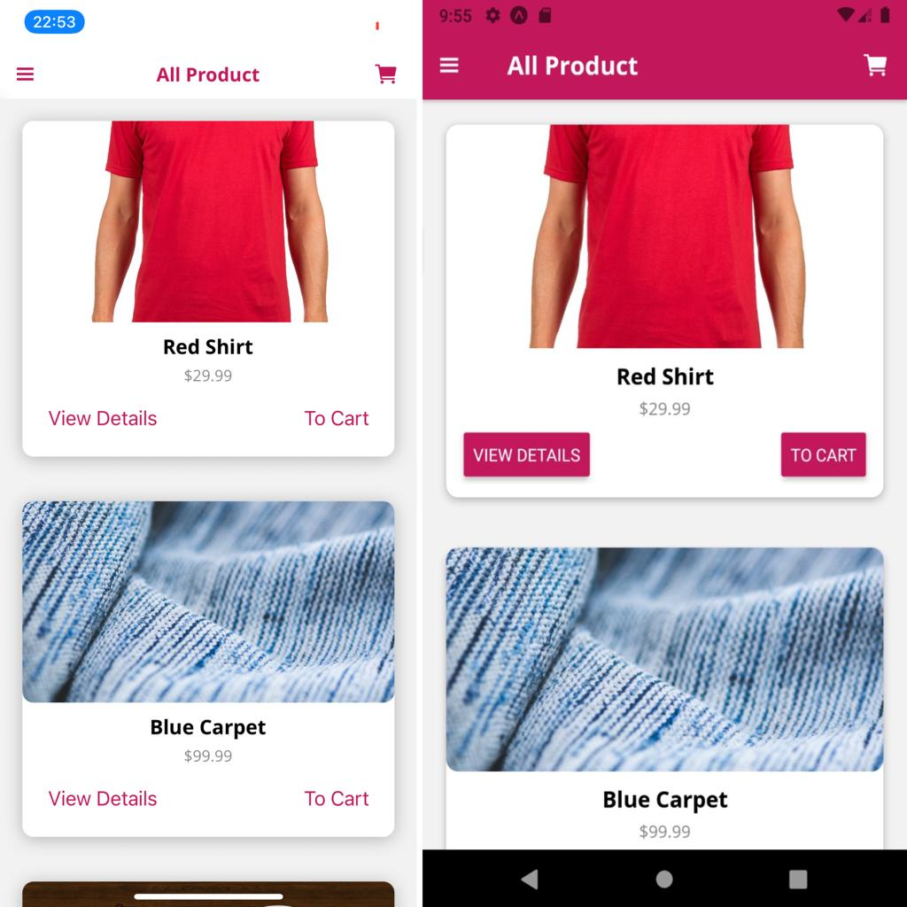
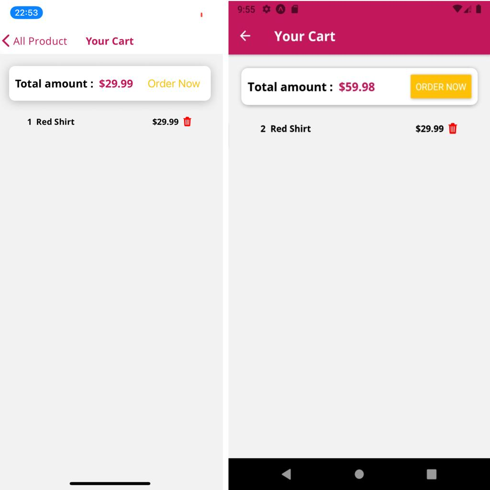
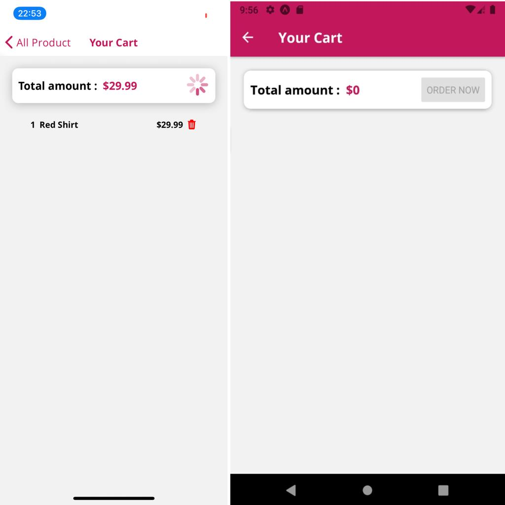
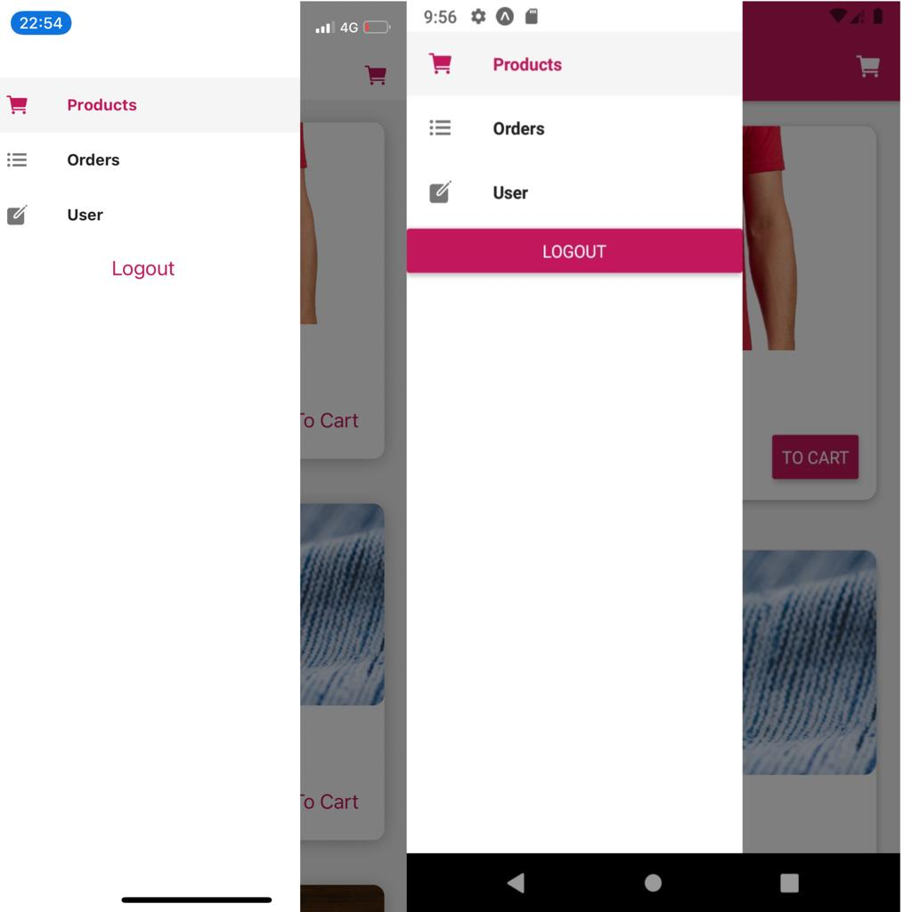
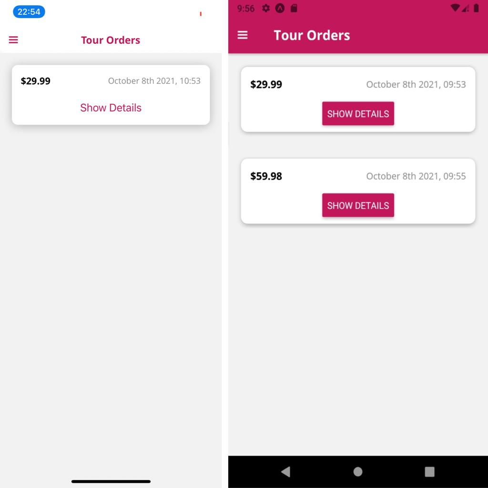
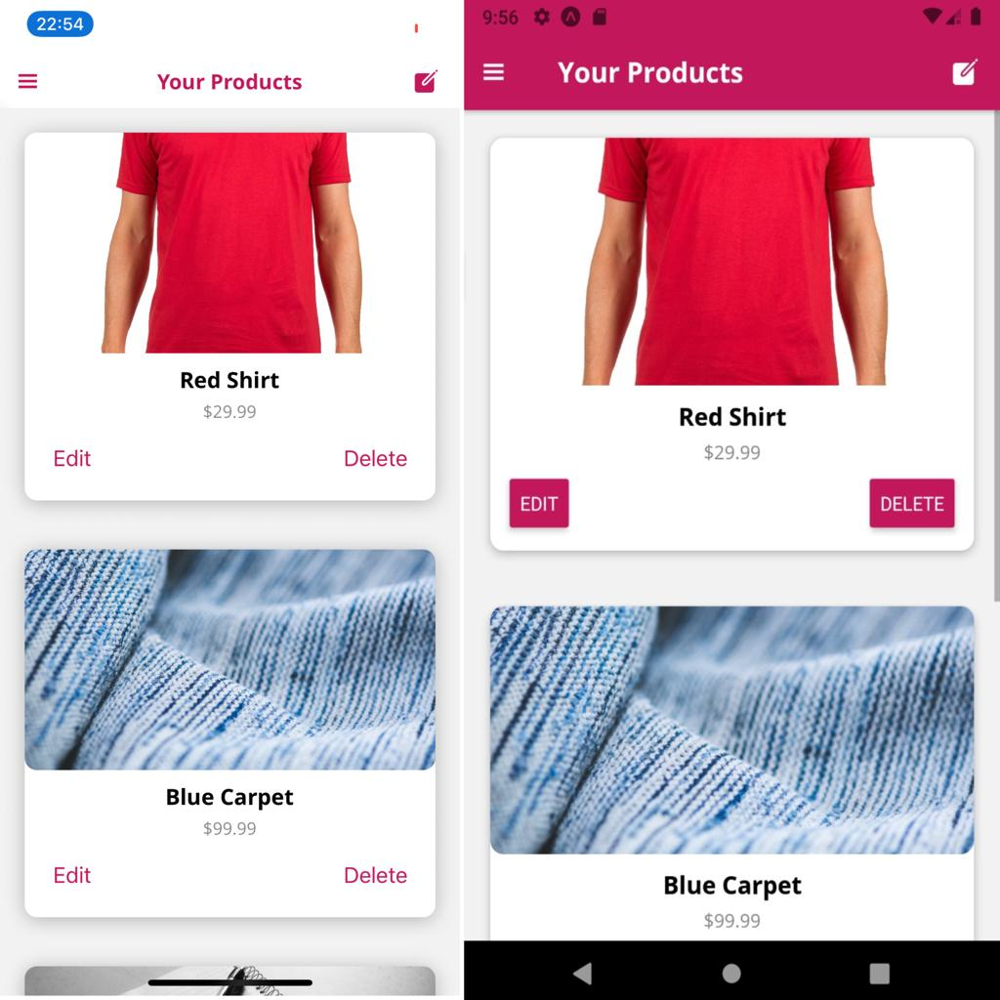
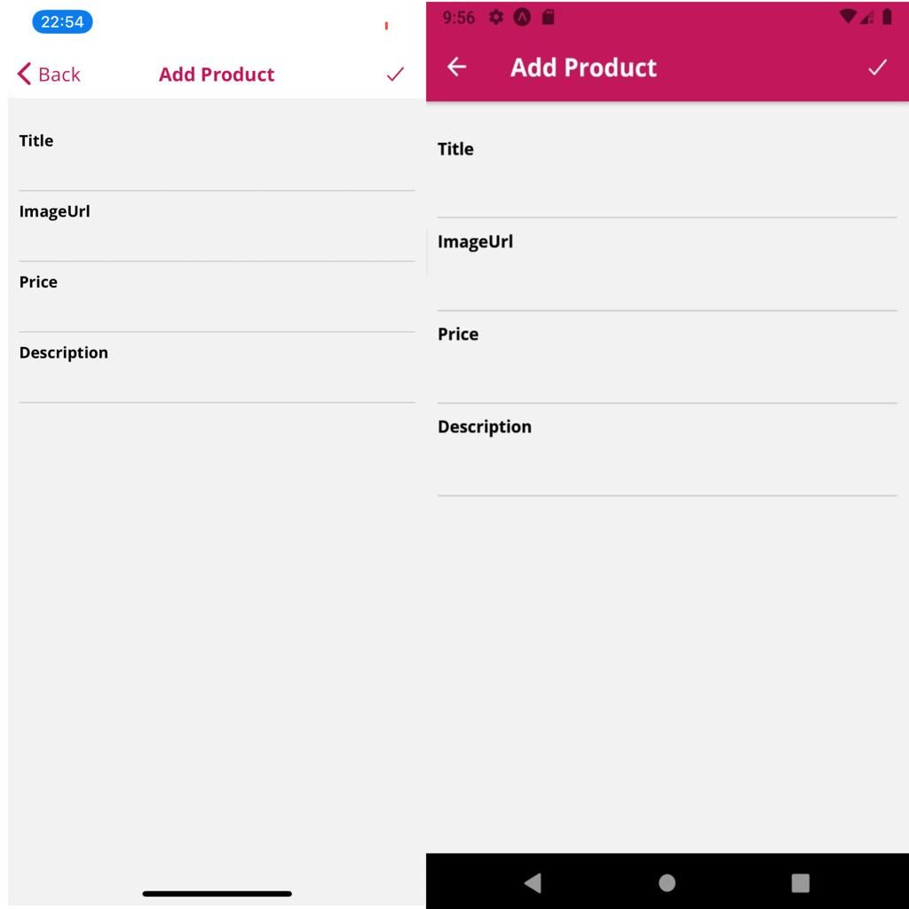

# Restaurant

### Installation

- run `npm install` or `yarn install`

- run `npm install redux@4.1.1` or `yarn add redux@4.1.1`

- run `npm install react-redux@7.2.4` or `yarn add react-redux@7.2.4`

- run `npm install redux-thunk@2.3.0` or `yarn add redux-thunk@2.3.0`

- run `npm install react-navigation@4.4.4` or `yarn add react-navigation@4.4.4`

### Run on Device

- run `yarn android` or `yarn ios` to run on device or emulator

### Project info

This project is simple example of a react native application a practice for :

-how to manage a DataBase (put, get, authentication) using Firebase,

-how to use navigation and navigate between screens,

-and also how to use Icons ,

-and also how to use redux (actions and reducers)

#### ScreenShots - Native App

